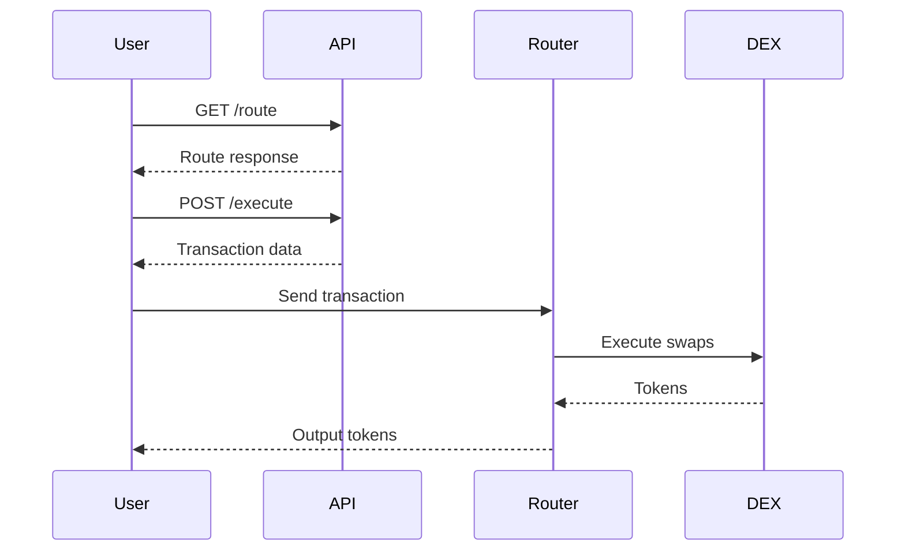

## Overview

The Execute endpoint generates the necessary transaction data to execute a token swap using a previously obtained route. This endpoint is available across all supported networks.

## Supported Networks

<Tabs>
  <Tab title="Base">
    ```bash
    https://api.fibrous.finance/base/execute
    ```
  </Tab>
  <Tab title="HyperEVM">
    ```bash
    https://api.fibrous.finance/hyperevm/execute
    ```
  </Tab>
  <Tab title="Scroll">
    ```bash
    https://api.fibrous.finance/scroll/execute
    ```
  </Tab>
  <Tab title="Monad">
    ```bash
    https://api.fibrous.finance/monad/execute
    ```
  </Tab>
  <Tab title="Starknet">
    ```bash
    https://api.fibrous.finance/starknet/execute
    ```
    <Note>Starknet execution uses Cairo-specific transaction format. See [Starknet API](/api-reference/starknet/endpoint/execute) for details.</Note>
  </Tab>
</Tabs>

## Request Body Parameters

<ParamField body="route" type="RouteResponse" required>
  The route object returned from the `/route` endpoint. This contains all necessary information about the swap path and expected outcomes.
</ParamField>

<ParamField body="slippage" type="number" default="0.5" required>
  Maximum acceptable slippage in percentage (0.1 to 100).
  
  Example: `0.5` for 0.5% slippage tolerance
</ParamField>

<ParamField body="destination" type="string" required>
  The destination address to receive the output tokens.
</ParamField>

<ParamField body="deadline" type="number">
  Unix timestamp (in seconds) after which the transaction will revert.
  
  Defaults to 20 minutes from the current time if not specified.
</ParamField>

## Response

<ResponseField name="route" type="object">
  The executed route details
  <Expandable>
    <ResponseField name="amount_in" type="string">
      The amount of input tokens in wei format
    </ResponseField>
    <ResponseField name="amount_out" type="string">
      The amount of output tokens in wei format
    </ResponseField>
    <ResponseField name="min_received" type="string">
      The minimum amount of output tokens accounting for slippage
    </ResponseField>
    <ResponseField name="destination" type="string">
      The destination address for the swap
    </ResponseField>
    <ResponseField name="swap_type" type="number">
      The type of swap operation
    </ResponseField>
  </Expandable>
</ResponseField>

<ResponseField name="swap_parameters" type="object[]">
  Swap parameters for every hop in the route
  <Expandable>
    <ResponseField name="token_in" type="string">
      The input token address for this hop
    </ResponseField>
    <ResponseField name="token_out" type="string">
      The output token address for this hop
    </ResponseField>
    <ResponseField name="rate" type="string">
      The exchange rate for this swap
    </ResponseField>
    <ResponseField name="protocol_id" type="string">
      The protocol identifier
    </ResponseField>
    <ResponseField name="pool_address" type="string">
      The pool address for this swap
    </ResponseField>
    <ResponseField name="swap_type" type="number">
      The type of swap for this hop
    </ResponseField>
    <ResponseField name="extra_data" type="string">
      Additional protocol-specific data
    </ResponseField>
  </Expandable>
</ResponseField>

<ResponseField name="calldata" type="string">
  The encoded transaction calldata ready for execution
</ResponseField>

<ResponseField name="to" type="string">
  The Fibrous Router contract address to send the transaction to
</ResponseField>

<ResponseField name="value" type="string">
  The amount of native token to send with the transaction (for native token swaps)
</ResponseField>

## Example Request

<CodeGroup>

```bash cURL
curl -X POST "https://api.fibrous.finance/base/execute" \
  -H "Content-Type: application/json" \
  -d '{
    "route": {
      "success": true,
      "inputToken": {
        "name": "Wrapped Ether",
        "address": "0x4200000000000000000000000000000000000006",
        "decimals": 18,
        "price": 3171.37
      },
      "outputToken": {
        "name": "USD Coin",
        "address": "0x833589fcd6edb6e08f4c7c32d4f71b54bda02913",
        "decimals": 6,
        "price": 0.99971
      },
      "inputAmount": "1000000000000000000",
      "outputAmount": "3165007379",
      "route": [...]
    },
    "slippage": 0.5,
    "destination": "0x1234567890123456789012345678901234567890"
  }'
```

```javascript JavaScript
const axios = require('axios');

const executeSwap = async () => {
  const response = await axios.post(
    'https://api.fibrous.finance/base/execute',
    {
      route: {
        inputToken: {
          address: '0x0000000000000000000000000000000000000000',
          decimals: 18,
          symbol: 'ETH'
        },
        outputToken: {
          address: '0x833589fCD6eDb6E08f4c7C32D4f71b54bdA02913',
          decimals: 6,
          symbol: 'USDC'
        },
        inputAmount: '1000000000000000000',
        outputAmount: '2500000000'
      },
      slippage: 0.5,
      destination: '0x1234567890123456789012345678901234567890'
    },
    {
      headers: {
        'Content-Type': 'application/json'
      }
    }
  );
  
  return response.data;
};
```

```python Python
import requests
import json

url = "https://api.fibrous.finance/base/execute"

payload = {
    "route": {
        "inputToken": {
            "address": "0x0000000000000000000000000000000000000000",
            "decimals": 18,
            "symbol": "ETH"
        },
        "outputToken": {
            "address": "0x833589fCD6eDb6E08f4c7C32D4f71b54bdA02913",
            "decimals": 6,
            "symbol": "USDC"
        },
        "inputAmount": "1000000000000000000",
        "outputAmount": "2500000000"
    },
    "slippage": 0.5,
    "destination": "0x1234567890123456789012345678901234567890"
}

headers = {
    'Content-Type': 'application/json'
}

response = requests.post(url, json=payload, headers=headers)
print(response.json())
```

</CodeGroup>

## Example Response

```json
{
  "route": {
    "amount_in": "1000000000000000000",
    "amount_out": "3165007379",
    "min_received": "3149182360",
    "destination": "0x1234567890123456789012345678901234567890",
    "swap_type": 0
  },
  "swap_parameters": [
    {
      "token_in": "0x4200000000000000000000000000000000000006",
      "token_out": "0x833589fcd6edb6e08f4c7c32d4f71b54bda02913",
      "rate": "3165007379",
      "protocol_id": "9",
      "pool_address": "0x72ab388e2e2f6facef59e3c3fa2c4e29011c2d38",
      "swap_type": 0,
      "extra_data": "0x0064"
    }
  ],
  "calldata": "0x...",
  "to": "0x274602a953847d807231d2370072f5f4e4594b44",
  "value": "1000000000000000000"
}
```

## Best Practices

1. **Route Freshness**
   - Always use a fresh route from the `/route` endpoint
   - Routes can become stale due to market movements
   - Implement retry logic with fresh routes if execution fails

2. **Slippage Management**
   - Set appropriate slippage tolerance based on:
     - Token pair volatility
     - Available liquidity
     - Market conditions
   - Higher values increase success rate but may result in worse prices
   - Lower values ensure better prices but may cause more failed transactions

3. **Deadline Setting**
   - Set reasonable deadlines to prevent stale transactions
   - Consider network congestion when setting deadlines
   - Default of 20 minutes is suitable for most cases

4. **Gas Optimization**
   - Monitor gas costs in responses to optimize future transactions
   - Consider using direct routes for major pairs
   - Batch multiple swaps when possible

## Error Responses

<AccordionGroup>
  <Accordion title="Route Expired">
    **Status Code:** 400
    
    ```json
    {
      "error": "Route expired",
      "message": "The provided route is no longer valid. Please fetch a new route."
    }
    ```
    
    **Solution:** Fetch a new route and retry the execution.
  </Accordion>

  <Accordion title="Insufficient Liquidity">
    **Status Code:** 400
    
    ```json
    {
      "error": "Insufficient liquidity",
      "message": "Not enough liquidity available for this swap amount."
    }
    ```
    
    **Solution:** Reduce the swap amount or try again later.
  </Accordion>

  <Accordion title="Invalid Slippage">
    **Status Code:** 400
    
    ```json
    {
      "error": "Invalid slippage",
      "message": "Slippage must be between 0.1 and 100"
    }
    ```
    
    **Solution:** Adjust slippage to be within the valid range.
  </Accordion>
</AccordionGroup>

## Network-Specific Notes

<Tabs>
  <Tab title="EVM Chains (Base, HyperEVM, Scroll)">
    - Use standard EVM transaction format
    - Native token swaps require sending value with transaction
    - Approve token spending before swap if not native token
    - Gas estimation included in response
  </Tab>
  
  <Tab title="Starknet">
    - Uses Cairo-specific transaction format
    - Different approval mechanism
    - See [Starknet Execute](/api-reference/starknet/endpoint/execute) for details
  </Tab>
</Tabs>

## Complete Swap Flow



## Related Endpoints

- [Get Route](/api-reference/endpoints/route) - Find optimal route before execution
- [Get Calldata](/api-reference/endpoints/calldata) - Alternative endpoint combining route and execute
- [Health Check](/api-reference/endpoints/health-check) - Check API status


