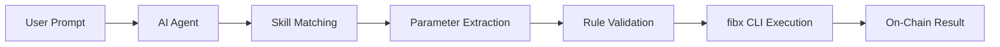

[fibx-skills](https://github.com/Fibrous-Finance/fibx-skills) is a collection of agent skills that wrap the `fibx` CLI for use by AI agents. Each skill defines a specific capability — authentication, balance checks, transfers, swaps, DeFi management, and transaction verification — with structured rules, allowed tools, and error handling.

Skills follow the [Agent Skills](https://agentskills.io) specification and can be imported into any compatible agent framework.

## How Skills Work

Each skill is a structured YAML+Markdown file that defines:

- **Allowed tools** — The exact CLI commands the agent is permitted to run
- **Rules** — Constraints and safety checks the agent must follow
- **Parameters** — Inputs the agent extracts from the user's natural language prompt
- **Error handling** — How the agent should respond to specific failures

When a user gives a natural language instruction (e.g., "Swap 0.1 ETH to USDC"), the agent matches it to the appropriate skill, extracts parameters, follows the defined rules, and executes the CLI commands in sequence.



## Getting Started

1. Clone the skills repository:

```bash
git clone https://github.com/Fibrous-Finance/fibx-skills.git
```

2. Import skills from the `./skills` directory into your agent's skill registry.

3. No separate installation of `fibx` is needed — all skills use `npx fibx@latest`.

<Note>
  Skills require Node.js 18+ and are compatible with fibx CLI v0.3.2 and above.
</Note>

---

## Available Skills

<AccordionGroup>
  <Accordion title="authenticate-wallet" icon="key">
    **Category:** Auth

    Manages the wallet session. This skill must run before any other wallet operation. Two authentication paths are available:

    - **Private key import** — Use an existing wallet directly. The key is encrypted and stored locally. This is the primary method for developers and agents that already manage their own keys.
    - **Email OTP** — Alternative method that creates a server-managed wallet via Privy. Use this when no private key is available.

    ### Allowed Tools
    ```
    Bash(npx fibx@latest auth import)
    Bash(npx fibx@latest auth login *)
    Bash(npx fibx@latest auth verify *)
    Bash(npx fibx@latest auth logout)
    Bash(npx fibx@latest status)
    ```

    ### Rules
    1. If the user has a private key ready, prefer `auth import` — it is the most direct path.
    2. For private key import, always warn the user first: _"Your private key will be stored locally in an encrypted session file. Shall I proceed?"_
    3. For email login, never ask the user for a private key. `auth login` must complete before `auth verify` — they are sequential steps.
    4. After successful authentication (either method), always run `status` to confirm the session.
    5. Never store or log private keys, OTP codes, or session tokens.

    ### Trigger Examples
    | User Prompt | Action |
    | --- | --- |
    | "Import my private key" | `auth import` |
    | "I have a wallet, let me use it" | `auth import` |
    | "Log me in with user@example.com" | `auth login` then `auth verify` |
    | "Log me out" | `auth logout` |
  </Accordion>

  <Accordion title="balance" icon="wallet">
    **Category:** Wallet

    Fetches native and ERC-20 token balances for the authenticated wallet on any supported chain.

    ### Allowed Tools
    ```
    Bash(npx fibx@latest balance *)
    Bash(npx fibx@latest balance)
    Bash(npx fibx@latest status)
    ```

    ### Rules
    1. If the user specifies a chain, include `--chain <name>`.
    2. If no chain is specified, default to `base` and state it.
    3. Use `--json` when output is consumed by another skill.

    ### Trigger Examples
    | User Prompt | Action |
    | --- | --- |
    | "Check my balance" | `balance` (defaults to Base) |
    | "What's my Monad balance?" | `balance --chain monad` |
  </Accordion>

  <Accordion title="send" icon="paper-plane">
    **Category:** Transaction

    Transfers native tokens or ERC-20 tokens to a destination address. Simulates the transaction before execution.

    ### Allowed Tools
    ```
    Bash(npx fibx@latest send *)
    Bash(npx fibx@latest status)
    Bash(npx fibx@latest balance *)
    Bash(npx fibx@latest balance)
    Bash(npx fibx@latest tx-status *)
    ```

    ### Rules
    1. Before any send, verify connectivity (`status`) and funds (`balance`).
    2. If the recipient address was not previously mentioned, ask for explicit confirmation.
    3. Use the correct native token symbol for each chain — never use `ETH` on non-Base chains.
    4. After a successful send, verify the transaction with `tx-status`.

    ### Trigger Examples
    | User Prompt | Action |
    | --- | --- |
    | "Send 10 USDC to 0x123..." | `send 10 0x123... USDC` |
    | "Send 0.05 MON to 0xdef... on Monad" | `send 0.05 0xdef... MON --chain monad` |
  </Accordion>

  <Accordion title="trade" icon="arrows-rotate">
    **Category:** Transaction

    Swaps tokens via Fibrous aggregation. Finds the optimal route, handles approvals, simulates, and executes.

    ### Allowed Tools
    ```
    Bash(npx fibx@latest trade *)
    Bash(npx fibx@latest status)
    Bash(npx fibx@latest balance *)
    Bash(npx fibx@latest balance)
    Bash(npx fibx@latest tx-status *)
    ```

    ### Rules
    1. Before any trade, verify connectivity and source token balance.
    2. Default slippage is 0.5%. To change it, ask the user for confirmation.
    3. Never use `--approve-max` unless the user explicitly requests it.
    4. After a successful trade, verify the transaction with `tx-status`.

    ### Trigger Examples
    | User Prompt | Action |
    | --- | --- |
    | "Swap 0.1 ETH for USDC" | `trade 0.1 ETH USDC` |
    | "Buy USDC with 1 MON on Monad" | `trade 1 MON USDC --chain monad` |
  </Accordion>

  <Accordion title="aave" icon="building-columns">
    **Category:** DeFi

    Manages Aave V3 lending positions on **Base only** — supply, borrow, repay, withdraw, and health factor monitoring.

    ### Allowed Tools
    ```
    Bash(npx fibx@latest aave *)
    Bash(npx fibx@latest status)
    Bash(npx fibx@latest balance *)
    Bash(npx fibx@latest balance)
    ```

    ### Rules
    1. This skill only works on Base. Refuse Aave operations on other chains.
    2. Before any action, check balance for sufficient gas (ETH).
    3. Before borrowing, check `aave status` for the Health Factor:
       - Health Factor < 1.5 → Warn the user about liquidation risk
       - Health Factor < 1.1 → Do not proceed without explicit double-confirmation
    4. When fully closing a position, always use `max` as the amount.
    5. The CLI handles ETH/WETH conversion automatically — use `ETH` as the symbol.

    ### Trigger Examples
    | User Prompt | Action |
    | --- | --- |
    | "How is my Aave position?" | `aave status` |
    | "Supply 100 USDC to Aave" | `aave supply 100 USDC` |
    | "Repay all my USDC debt" | `aave repay max USDC` |
  </Accordion>

  <Accordion title="tx-status" icon="magnifying-glass">
    **Category:** Utility

    Checks the on-chain status of a transaction and returns the block explorer link. No authentication is required — this is a public chain query.

    ### Allowed Tools
    ```
    Bash(npx fibx@latest tx-status *)
    ```

    ### Rules
    1. Use the same `--chain` flag that was used for the original transaction.
    2. Use this skill after every `send` or `trade` to verify success.

    ### Trigger Examples
    | User Prompt | Action |
    | --- | --- |
    | "Did my transaction go through?" | `tx-status <hash>` |
    | "Check tx 0xabc...def on Monad" | `tx-status 0xabc...def --chain monad` |
  </Accordion>
</AccordionGroup>

---

## Agent Workflow Example

A typical multi-step interaction between a user and an AI agent using fibx-skills:

<Tabs>
  <Tab title="With Private Key">
    <Steps>
      <Step title="User: 'Import my private key'">
        Agent triggers **authenticate-wallet**:
        ```bash
        npx fibx@latest auth import
        npx fibx@latest status
        ```
        The user pastes their private key in the interactive prompt. Session is now active.
      </Step>
      <Step title="User: 'Swap 0.05 ETH to USDC'">
        Agent triggers **balance** then **trade**:
        ```bash
        npx fibx@latest balance
        npx fibx@latest trade 0.05 ETH USDC
        ```
      </Step>
      <Step title="Agent verifies automatically">
        Agent triggers **tx-status**:
        ```bash
        npx fibx@latest tx-status 0x7a3f...c21b
        ```
        Agent responds: _"Swap completed. 0.05 ETH → 47.23 USDC. [View on BaseScan](https://basescan.org/tx/0x7a3f...c21b)"_
      </Step>
    </Steps>
  </Tab>
  <Tab title="With Email OTP">
    <Steps>
      <Step title="User: 'Log me in with alice@example.com'">
        Agent triggers **authenticate-wallet**:
        ```bash
        npx fibx@latest auth login alice@example.com
        ```
        Agent asks: _"Please provide the OTP code sent to your email."_
      </Step>
      <Step title="User: '482910'">
        Agent completes authentication:
        ```bash
        npx fibx@latest auth verify alice@example.com 482910
        npx fibx@latest status
        ```
      </Step>
      <Step title="User: 'Swap 0.05 ETH to USDC'">
        Agent triggers **balance** then **trade**:
        ```bash
        npx fibx@latest balance
        npx fibx@latest trade 0.05 ETH USDC
        ```
      </Step>
      <Step title="Agent verifies automatically">
        Agent triggers **tx-status**:
        ```bash
        npx fibx@latest tx-status 0x7a3f...c21b
        ```
        Agent responds: _"Swap completed. 0.05 ETH → 47.23 USDC. [View on BaseScan](https://basescan.org/tx/0x7a3f...c21b)"_
      </Step>
    </Steps>
  </Tab>
</Tabs>
