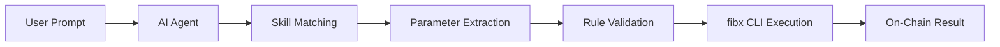

[fibx-skills](https://github.com/Fibrous-Finance/fibx-skills) is a collection of agent skills that wrap the `fibx` CLI for use by AI agents. Each skill defines a specific capability — authentication, balances, portfolio inspection, transfers, swaps, DeFi management, and transaction verification — with structured rules, allowed tools, and error handling.

Skills follow the [Agent Skills](https://agentskills.io) specification and can be imported into any compatible agent framework.

## How Skills Work

Each skill is a structured YAML+Markdown file that defines:

- **Allowed tools** — The CLI command patterns declared by the installed skill
- **Rules** — Constraints and safety checks the agent must follow
- **Parameters** — Inputs the agent extracts from the user's natural language prompt
- **Error handling** — How the agent should respond to specific failures

When a user gives a natural language instruction (e.g., "Swap 0.1 ETH to USDC"), the agent matches it to the appropriate skill, extracts parameters, follows the defined rules, and executes the CLI commands in sequence.


```mermaid
flowchart LR
    A[User Prompt] --> B[AI Agent]
    B --> C[Skill Matching]
    C --> D[Parameter Extraction]
    D --> E[Rule Validation]
    E --> F["fibx CLI Execution"]
    F --> G[On-Chain Result]
```

## Getting Started

Install the skills directly using the Vercel Skills CLI:

```bash
npx skills add Fibrous-Finance/fibx-skills
```

Or clone the repository manually and import from the `./skills` directory:

```bash
git clone https://github.com/Fibrous-Finance/fibx-skills.git
```

No separate installation of `fibx` is needed — all skills use `npx fibx@latest`.

<Note>
  Skills require Node.js 18+ and are compatible with fibx CLI v0.8.x.
  The installed `SKILL.md` files are the source of truth for allowed-tool
  patterns and rules; the summaries below describe the current published
  skills and may change independently of this page.
</Note>

---

## Available Skills

<AccordionGroup>
  <Accordion title="quote" icon="tag">
    **Category:** Read-Only

    Fetches a swap price without a wallet or a session, so an agent can answer a pricing question for a user who has not logged in — and then offer `authenticate-wallet` if they want to execute.

    ### Allowed Tools
    ```
    Bash(npx fibx@latest quote *)
    ```

    ### Rules
    1. Never require or suggest authentication before quoting — this skill needs none.
    2. If the user specifies a chain, include `--chain <name>`; otherwise default to `base` and say so.
    3. Default slippage is 0.5%. Include `--slippage` only when the user explicitly requests another value.
    4. Direct native/wrapped-native pairs return a 1:1 wrap or unwrap quote.
    5. After quoting, offer `trade` as the execution step, noting that it does require a session.

    ### Trigger Examples
    | User Prompt | Action |
    | --- | --- |
    | "How much USDC for 0.1 ETH?" | `quote 0.1 ETH USDC` |
    | "What's the MON price in USDC?" | `quote 1 MON USDC --chain monad` |
  </Accordion>

  <Accordion title="authenticate-wallet" icon="key">
    **Category:** Auth

    Manages the wallet session. This skill must run before any other wallet operation. Two authentication paths are available:

    - **Private key import** — Use an existing wallet directly. The key is encrypted and stored locally. This is the primary method for developers and agents that already manage their own keys.
    - **Email OTP** — Alternative method that creates a server-managed wallet via Privy. Use this when no private key is available.

    ### Allowed Tools
    ```
    Bash(npx fibx@latest auth import)
    Bash(npx fibx@latest auth login *)
    Bash(npx fibx@latest auth verify *)
    Bash(npx fibx@latest auth logout)
    Bash(npx fibx@latest status)
    ```

    ### Rules
    1. If the user has a private key ready, prefer `auth import` — it is the most direct path.
    2. For private key import, always warn the user first: _"Your private key will be stored locally in an encrypted session file. Shall I proceed?"_
    3. For email login, never ask the user for a private key. `auth login` must complete before `auth verify` — they are sequential steps.
    4. After successful authentication (either method), always run `status` to confirm the session.
    5. Never store or log private keys, OTP codes, or session tokens.

    ### Trigger Examples
    | User Prompt | Action |
    | --- | --- |
    | "Import my private key" | `auth import` |
    | "I have a wallet, let me use it" | `auth import` |
    | "Log me in with user@example.com" | `auth login` then `auth verify` |
    | "Log me out" | `auth logout` |
  </Accordion>

  <Accordion title="wallet-info" icon="id-card">
    **Category:** Wallet

    Reports which wallet is active — address, wallet ID, session type, and when the session was created. Use it when the user asks for their receiving address or which account they are signed in as.

    ### Allowed Tools
    ```
    Bash(npx fibx@latest address)
    Bash(npx fibx@latest address *)
    Bash(npx fibx@latest wallets)
    Bash(npx fibx@latest wallets *)
    ```

    **Prerequisite:** An active session is required. If no session is active,
    run the `authenticate-wallet` skill first.

    ### Rules
    1. Use `address` when only the receiving address is needed; use `wallets` for full session details.
    2. Neither command takes `--chain` — the same address is used on every supported chain.
    3. Always show the full address. Never truncate an address the user may need to copy.
    4. Use `--json` when another skill or automation will consume the output.

    ### Trigger Examples
    | User Prompt | Action |
    | --- | --- |
    | "What's my wallet address?" | `address` |
    | "Which wallet am I using?" | `wallets` |
  </Accordion>

  <Accordion title="balance" icon="wallet">
    **Category:** Wallet

    Fetches native and ERC-20 token balances for the authenticated wallet on any supported chain.

    ### Allowed Tools
    ```
    Bash(npx fibx@latest balance *)
    Bash(npx fibx@latest balance)
    Bash(npx fibx@latest status)
    ```

    ### Rules
    1. If the user specifies a chain, include `--chain <name>`.
    2. If no chain is specified, default to `base` and state it.
    3. Use `--json` when output is consumed by another skill.

    ### Trigger Examples
    | User Prompt | Action |
    | --- | --- |
    | "Check my balance" | `balance` (defaults to Base) |
    | "What's my Monad balance?" | `balance --chain monad` |
  </Accordion>

  <Accordion title="portfolio" icon="chart-pie">
    **Category:** Wallet

    Fetches a consolidated cross-chain portfolio view with USD valuations for all token holdings and DeFi positions across Base, Citrea, HyperEVM, and Monad.

    ### Allowed Tools
    ```
    Bash(npx fibx@latest portfolio *)
    Bash(npx fibx@latest portfolio)
    Bash(npx fibx@latest status)
    ```

    ### Rules
    1. This command fetches all supported chains in parallel, so no `--chain` flag is needed.
    2. Use `--json` when the output will be consumed by another skill or automation pipeline.
    3. Chains with zero holdings may be hidden in the output.
    4. DeFi positions on Aave V3 are included automatically when present.

    ### Trigger Examples
    | User Prompt | Action |
    | --- | --- |
    | "Show me my portfolio" | `portfolio` |
    | "What's my total net worth?" | `portfolio` |
    | "Get my portfolio as JSON" | `portfolio --json` |
  </Accordion>

  <Accordion title="send" icon="paper-plane">
    **Category:** Transaction

    Transfers native tokens or ERC-20 tokens to a destination address. The CLI
    performs a command-specific preflight and supports `--simulate` for a
    transfer preview.

    ### Allowed Tools
    ```
    Bash(npx fibx@latest send *)
    Bash(npx fibx@latest status)
    Bash(npx fibx@latest balance *)
    Bash(npx fibx@latest balance)
    Bash(npx fibx@latest tx-status *)
    ```

    ### Rules
    1. Before any send, verify connectivity (`status`) and funds (`balance`).
    2. If the recipient address was not previously mentioned, ask for explicit confirmation.
    3. If the user specifies a chain, include `--chain <name>`; otherwise default to `base` and say so.
    4. Use the correct native token symbol for each chain — never use `ETH` on non-Base chains.
    5. After a successful send, verify the transaction with `tx-status` on the same chain.

    ### Trigger Examples
    | User Prompt | Action |
    | --- | --- |
    | "Send 10 USDC to 0x123..." | `send 10 0x123... USDC` |
    | "Send 0.05 MON to 0xdef... on Monad" | `send 0.05 0xdef... MON --chain monad` |
  </Accordion>

  <Accordion title="trade" icon="arrows-rotate">
    **Category:** Transaction

    Swaps tokens via Fibrous aggregation. Finds a route, handles approvals,
    estimates the main swap path, and executes.

    ### Allowed Tools
    ```
    Bash(npx fibx@latest trade *)
    Bash(npx fibx@latest quote *)
    Bash(npx fibx@latest status)
    Bash(npx fibx@latest balance *)
    Bash(npx fibx@latest balance)
    Bash(npx fibx@latest tx-status *)
    ```

    ### Rules
    1. Before any trade, verify connectivity and source token balance.
    2. If the user specifies a chain, include `--chain <name>`; otherwise default to `base` and say so.
    3. Default slippage is 0.5%. To change it, ask the user for confirmation.
    4. Never use `--approve-max` unless the user explicitly requests it.
    5. After a successful trade, verify the transaction with `tx-status` on the same chain.

    <Note>
      `trade --simulate` does not broadcast an approval or swap. When an ERC-20
      approval is required, it returns `requiresApproval: true` without a gas
      estimate.
    </Note>

    <Warning>
      A live routed ERC-20 trade can leave an approval on-chain if the later
      swap estimate or submission fails. Treat the approval and swap as
      separate transactions.
    </Warning>

    ### Trigger Examples
    | User Prompt | Action |
    | --- | --- |
    | "Swap 0.1 ETH for USDC" | `trade 0.1 ETH USDC` |
    | "Buy USDC with 1 MON on Monad" | `trade 1 MON USDC --chain monad` |
  </Accordion>

  <Accordion title="aave" icon="building-columns">
    **Category:** DeFi

    Manages Aave V3 lending positions on **Base only** — status, markets, supply, borrow, repay, withdraw, and health factor monitoring. ETH supply and repay can auto-wrap to WETH, while ETH withdraw can auto-unwrap to ETH. Borrowing the ETH market returns WETH.

    `aave markets` is a public query. `aave status` and all transactional actions
    require an active session. An action with `--simulate` returns request
    metadata without on-chain validation or a gas estimate.

    ### Allowed Tools
    ```
    Bash(npx fibx@latest aave *)
    Bash(npx fibx@latest status)
    Bash(npx fibx@latest balance *)
    Bash(npx fibx@latest balance)
    ```

    ### Rules
    1. This skill only works on Base. Refuse Aave operations on other chains.
    2. Before any action, check balance for sufficient ETH for gas.
    3. Before borrowing, check `aave status` for the Health Factor:
       - Health Factor < 1.5 → Warn the user about liquidation risk
       - Health Factor < 1.1 → Do not proceed without explicit double-confirmation
    4. `max` is supported only for `repay` and `withdraw`. Use it when fully repaying debt or withdrawing a supplied position to avoid dust residuals.
    5. Use `ETH` for ETH-market supply, repay, and withdraw so the CLI can apply
       the documented wrap/unwrap behavior. Borrowing that market returns WETH.
    6. If a `Rate limit / 429` error occurs, use the `config` skill to set a custom RPC.

    ### ETH ↔ WETH Auto-Wrap Reference
    | Action | ETH Behavior |
    | --- | --- |
    | `supply 1 ETH` | Auto-wraps ETH → WETH before supplying |
    | `borrow 1 ETH` | Borrows WETH; no automatic unwrap |
    | `repay max ETH` | Auto-wraps ETH → WETH before repaying |
    | `withdraw max ETH` | Withdraws WETH and auto-unwraps → ETH |

    <Warning>
      Live wrap, approval, Aave, and unwrap steps are separate transactions, so
      an earlier step remains on-chain if a later one fails. `aave withdraw max
      ETH` unwraps the wallet's entire post-withdraw WETH balance, including
      WETH held before the command.
    </Warning>

    ### Trigger Examples
    | User Prompt | Action |
    | --- | --- |
    | "How is my Aave position?" | `aave status` |
    | "What markets are on Aave?" | `aave markets` |
    | "Supply 1 ETH to Aave" | `aave supply 1 ETH` |
    | "Supply 100 USDC to Aave" | `aave supply 100 USDC` |
    | "Repay my ETH debt" | `aave repay max ETH` |
    | "Repay all my USDC debt" | `aave repay max USDC` |
    | "Withdraw all my ETH" | `aave withdraw max ETH` |
  </Accordion>

  <Accordion title="config" icon="gear">
    **Category:** Utility

    View and modify fibx CLI configuration — primarily used to set custom RPC URLs when hitting rate limits on public endpoints. Configuration is stored locally and persists across sessions.

    ### Allowed Tools
    ```
    Bash(npx fibx@latest config *)
    ```

    ### Rules
    1. If any command fails with a "Rate limit exceeded" or "429" error, use this skill to set a custom RPC for the affected chain.
    2. Settings use the OS-specific FibX config directory and persist across
       sessions (for example, `~/.config/fibx-nodejs/config.json` on Linux and
       `~/Library/Preferences/fibx-nodejs/config.json` on macOS).
    3. The CLI validates URL format but not connectivity — ensure the RPC URL is valid before setting.

    ### Commands
    ```bash
    # Set a custom RPC for a chain
    npx fibx@latest config set-rpc <chain> <url>

    # View the current RPC for a chain
    npx fibx@latest config get-rpc <chain>

    # Reset one chain or all chains to default
    npx fibx@latest config reset-rpc <chain>
    npx fibx@latest config reset-rpc

    # List all custom configurations
    npx fibx@latest config list
    ```

    ### Trigger Examples
    | User Prompt | Action |
    | --- | --- |
    | "I'm getting rate limit errors" | `config set-rpc <chain> <url>` |
    | "I'm getting rate limited on Base" | `config set-rpc base https://mainnet.base.org` |
    | "Reset all RPCs to default" | `config reset-rpc` |
    | "Check my current configuration" | `config list` |
  </Accordion>

  <Accordion title="tx-status" icon="magnifying-glass">
    **Category:** Utility

    Checks the on-chain status of a transaction and returns the block explorer link. No authentication is required — this is a public chain query.

    ### Allowed Tools
    ```
    Bash(npx fibx@latest tx-status *)
    ```

    ### Rules
    1. Use the same `--chain` flag that was used for the original transaction.
    2. Use this skill after every `send` or `trade` to verify success.

    ### Trigger Examples
    | User Prompt | Action |
    | --- | --- |
    | "Did my transaction go through?" | `tx-status <hash>` |
    | "Check tx 0xabc...def on Monad" | `tx-status 0xabc...def --chain monad` |
  </Accordion>
</AccordionGroup>

---

## Agent Workflow Example

A typical multi-step interaction between a user and an AI agent using fibx-skills:

<Tabs>
  <Tab title="With Private Key">
    <Steps>
      <Step title="User: 'Import my private key'">
        Agent triggers **authenticate-wallet**:
        ```bash
        npx fibx@latest auth import
        npx fibx@latest status
        ```
        The user pastes their private key in the interactive prompt. Session is now active.
      </Step>
      <Step title="User: 'Swap 0.05 ETH to USDC'">
        Agent triggers **balance** then **trade**:
        ```bash
        npx fibx@latest balance
        npx fibx@latest trade 0.05 ETH USDC
        ```
      </Step>
      <Step title="Agent verifies automatically">
        Agent triggers **tx-status**:
        ```bash
        npx fibx@latest tx-status 0x7a3f...c21b
        ```
        Agent responds: _"Swap completed. 0.05 ETH → 47.23 USDC. [View on BaseScan](https://basescan.org/tx/0x7a3f...c21b)"_
      </Step>
    </Steps>
  </Tab>
  <Tab title="With Email OTP">
    <Steps>
      <Step title="User: 'Log me in with alice@example.com'">
        Agent triggers **authenticate-wallet**:
        ```bash
        npx fibx@latest auth login alice@example.com
        ```
        Agent asks: _"Please provide the OTP code sent to your email."_
      </Step>
      <Step title="User: '482910'">
        Agent completes authentication:
        ```bash
        npx fibx@latest auth verify alice@example.com 482910
        npx fibx@latest status
        ```
      </Step>
      <Step title="User: 'Swap 0.05 ETH to USDC'">
        Agent triggers **balance** then **trade**:
        ```bash
        npx fibx@latest balance
        npx fibx@latest trade 0.05 ETH USDC
        ```
      </Step>
      <Step title="Agent verifies automatically">
        Agent triggers **tx-status**:
        ```bash
        npx fibx@latest tx-status 0x7a3f...c21b
        ```
        Agent responds: _"Swap completed. 0.05 ETH → 47.23 USDC. [View on BaseScan](https://basescan.org/tx/0x7a3f...c21b)"_
      </Step>
    </Steps>
  </Tab>
</Tabs>
