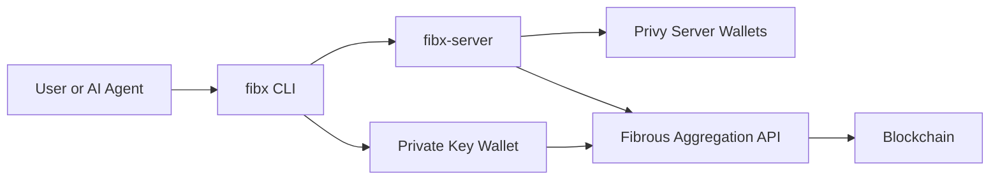

FibX is a CLI-based DeFi execution layer that enables both developers and AI agents to perform on-chain operations — token swaps, transfers, balance checks, cross-chain portfolio inspection, and Aave V3 position management — across **Base, Citrea, HyperEVM, and Monad**.

It combines [Fibrous](https://fibrous.finance) aggregation for optimal swap routing with flexible wallet authentication — use your own private key directly, or create a server-managed wallet via [Privy](https://privy.io).

## Core Capabilities

<CardGroup cols={2}>
  <Card title="Portfolio View" icon="chart-pie">
    Consolidated cross-chain portfolio view with USD valuations, token balances, Aave collateral and debt, and total net worth across all supported chains.
  </Card>
  <Card title="Token Swaps" icon="arrows-rotate">
    Optimal routing via Fibrous aggregation with auto-slippage. Supports all tokens across integrated DEXs on each chain.
  </Card>
  <Card title="Transfers" icon="paper-plane">
    Send native tokens (ETH, cBTC, HYPE, MON) or ERC-20 tokens to an address, with command-specific preflight and preview support.
  </Card>
  <Card title="Aave V3" icon="building-columns">
    Supply, borrow, repay, withdraw, and browse active markets on Base. ETH supply and repay can auto-wrap, ETH withdraw can auto-unwrap, and borrowing the ETH market returns WETH.
  </Card>
  <Card title="Agent Skills" icon="robot">
    Ten pre-built skills that allow AI agents to check prices, authenticate, inspect balances and portfolios, trade, send, manage Aave positions, verify transactions, and configure RPC endpoints — all through natural language.
  </Card>
</CardGroup>

## How It Works

FibX operates as a CLI tool (`npx fibx@latest`) that communicates with the Fibrous aggregation stack and, when needed, a backend server for Privy-managed wallet operations. Transaction paths use command-specific estimates or contract simulations where implemented, but those checks do not guarantee that an on-chain operation will succeed.


```mermaid
flowchart LR
    A[User or AI Agent] --> B[fibx CLI]
    B --> C[Private Key Wallet]
    B --> D[fibx-server]
    D --> E[Privy Server Wallets]
    C --> F[Fibrous Aggregation API]
    D --> F
    F --> G[Blockchain]
```

## Supported Chains

| Chain    | Native Token | CLI Flag           | Aave V3 |
| -------- | ------------ | ------------------ | ------- |
| Base     | ETH          | `--chain base`     | Yes     |
| Citrea   | cBTC         | `--chain citrea`   | No      |
| HyperEVM | HYPE         | `--chain hyperevm` | No      |
| Monad    | MON          | `--chain monad`    | No      |

## Security Model

FibX moves real funds. Treat client confirmation, preview output, signing policy,
and backend credentials as separate controls; none replaces reviewing the final
transaction request.

<CardGroup cols={2}>
  <Card title="Signing-Policy Scope" icon="shield-halved">
    With the default configuration, new Privy wallets are attached to a default-deny policy whose transaction rules allowlist configured chain IDs and cap the native `value` field. The cap does not limit ERC-20 amounts encoded in calldata; those transactions, along with message and typed-data requests, also rely on `fibx-server` validation. A custom `WALLET_POLICY_ID` is checked for existence, not compared with the default rule set.
  </Card>
  <Card title="Client Confirmation Hints" icon="hand">
    Transactional MCP tools carry the `destructiveHint` annotation. MCP clients may use this metadata to request confirmation, depending on the client and its configuration.
  </Card>
  <Card title="Signing Modes" icon="key">
    In Privy mode, transaction signing returns a signed transaction payload to the CLI; message and typed-data signing return signatures. The raw private key is not returned. The default policy includes a key-export denial rule, but administrators with policy-management credentials can change controls, so `fibx-server` and the Privy app secret remain trust boundaries. In private-key mode, FibX encrypts the imported key at rest with AES-256-GCM and signs locally.
  </Card>
  <Card title="Preview Limitations" icon="flask">
    `--simulate` and `simulate=true` provide no-broadcast previews for supported write paths, but the returned checks are command-specific. Gas estimates are included only where they can be calculated safely, and an Aave action preview does not perform on-chain validation. A preview does not guarantee that later execution will succeed.
  </Card>
</CardGroup>

<Note>
  The policy is defense in depth on the normal signing path, not a containment
  guarantee. The Privy app credentials authorize both signing and policy
  administration, so the backend that holds them is the administrative trust
  boundary.
</Note>

## Typical Workflow

Every FibX session follows the same four-step pattern:

<Steps>
  <Step title="Authenticate">
    Import your private key for direct usage, or log in via email OTP to create a Privy server wallet. Either method creates a session that persists across commands.
  </Step>
  <Step title="Check Funds">
    Query native and ERC-20 token balances on the target chain, or inspect the full cross-chain portfolio with USD valuations.
  </Step>
  <Step title="Execute">
    Review the amount, tokens, destination, chain, and any approval. Use the command-specific preview options where appropriate, then submit the operation on-chain.
  </Step>
  <Step title="Verify">
    Check the transaction status and obtain the block explorer link.
  </Step>
</Steps>

## Quick Example

```bash
# Check a price first — no wallet, no login required
npx fibx@latest quote 0.01 ETH USDC

# Authenticate with your private key
npx fibx@latest auth import

# Check balance on Base
npx fibx@latest balance

# View your cross-chain portfolio
npx fibx@latest portfolio

# Swap 0.1 ETH for USDC
npx fibx@latest trade 0.1 ETH USDC

# Verify the transaction
npx fibx@latest tx-status 0xabc...def
```

## Two Ways to Use FibX

<Tabs>
  <Tab title="As a CLI Tool">
    Run commands directly in your terminal. Ideal for developers who want programmatic access to DeFi operations or need to script workflows.

    ```bash
    npx fibx@latest portfolio --json
    npx fibx@latest trade 0.05 ETH USDC --chain base --simulate
    ```
  </Tab>
  <Tab title="As Agent Skills">
    Import the [fibx-skills](https://github.com/Fibrous-Finance/fibx-skills) into your AI agent's skill registry. The agent interprets natural language prompts and maps them to the appropriate CLI commands.

    | User Prompt                      | Skill Triggered       |
    | -------------------------------- | --------------------- |
    | "How much USDC for 0.1 ETH?"    | `quote`               |
    | "What's my wallet address?"      | `wallet-info`         |
    | "Swap 0.05 ETH to USDC"         | `trade`               |
    | "Check my balance on Monad"      | `balance`             |
    | "Show me my portfolio"           | `portfolio`           |
    | "Send 10 USDC to 0x123..."      | `send`                |
    | "Supply 100 USDC to Aave"       | `aave`                |
    | "I'm getting rate limit errors"  | `config`              |
  </Tab>
</Tabs>

## Telegram Bot

[fibx-telegram-bot](https://github.com/Fibrous-Finance/fibx-telegram-bot) puts the
same execution layer in a chat window. It drives the FibX MCP server, exposing
capabilities such as quotes, swaps, transfers, portfolio, and Aave through
natural language rather than CLI flags.

- **Bring your own model.** Choose OpenAI, Claude or Gemini and supply your own
  API key. There is no shared key and no centralized inference billing; keys are
  encrypted at rest. `/deletekey` clears the provider configuration and
  encrypted key, FibX session/config/cache, pending authentication, and chat
  history; price alerts remain active.
- **Per-user runtime state.** Every active user gets a dedicated MCP process and
  separate HOME/XDG paths. These processes still run under the same OS account,
  so this is application-level separation rather than an OS sandbox.
- **Price alerts.** `/alert ETH above 4000` notifies you once when the price is
  reached — no login or AI key required.

## Resources

<CardGroup cols={2}>
  <Card title="npm Package" icon="npm" href="https://www.npmjs.com/package/fibx">
    fibx v0.8.2 — install and version history
  </Card>
  <Card title="Agent Skills" icon="github" href="https://github.com/Fibrous-Finance/fibx-skills">
    Ten pre-built skills for AI agent integration
  </Card>
  <Card title="MCP Configuration" icon="plug" href="/fibx-agent/mcp-configuration">
    Connect FibX to Cursor, Claude Desktop, VS Code, Windsurf, and Antigravity
  </Card>
  <Card title="Telegram Bot" icon="telegram" href="https://github.com/Fibrous-Finance/fibx-telegram-bot">
    Chat-based DeFi execution with your own AI model
  </Card>
</CardGroup>
