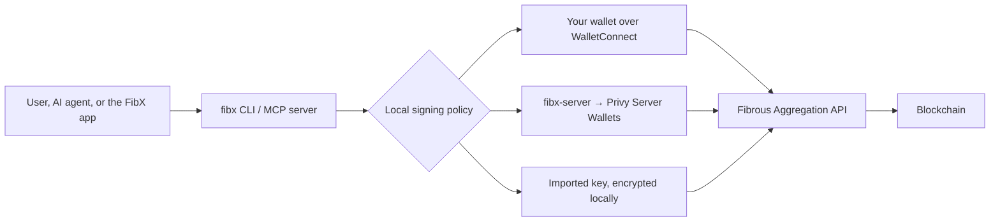

FibX is a DeFi execution layer for developers and AI agents — token swaps, transfers, balance checks, cross-chain portfolio inspection, and Aave V3 position management — across **Base, HyperEVM, and Monad**. One published package serves three surfaces: `fibx <command>` for people, `fibx mcp-start` for agents, and, in hosts that render [MCP Apps](https://modelcontextprotocol.io/docs/extensions/apps) UI, **the FibX app** inside the chat.

It combines [Fibrous](https://fibrous.finance) aggregation for optimal swap routing with a choice of how transactions are signed: your own wallet over WalletConnect, a server-managed wallet via [Privy](https://privy.io), or a private key imported onto the machine — every path bounded by a [signing policy](/fibx-agent/signing) that lives in a file you own.

## Core Capabilities

<CardGroup cols={2}>
  <Card title="The FibX App" icon="window">
    In Claude Desktop and other hosts that render MCP Apps UI, one tool opens the whole app in the chat — wallet, balances, signing policy, and a swap form with the Fibrous route. The model opens it; you press Simulate and Swap.
  </Card>
  <Card title="Portfolio View" icon="chart-pie">
    Consolidated cross-chain portfolio view with USD valuations, token balances, Aave collateral and debt, and total net worth across all supported chains.
  </Card>
  <Card title="Token Swaps" icon="arrows-rotate">
    Optimal routing via Fibrous aggregation with configurable slippage
    (default: 0.5%). Supports the tokens and integrated DEX liquidity available
    through Fibrous on each chain.
  </Card>
  <Card title="Transfers" icon="paper-plane">
    Send native tokens (ETH, HYPE, MON) or ERC-20 tokens to an address, with command-specific preflight and preview support.
  </Card>
  <Card title="Aave V3" icon="building-columns">
    Supply, borrow, repay, withdraw, and browse active markets on Base. ETH supply and repay can auto-wrap, ETH withdraw can auto-unwrap, and borrowing the ETH market returns WETH.
  </Card>
  <Card title="Agent Skills" icon="robot">
    Eleven pre-built skills that allow AI agents to check prices, authenticate, set a signing policy, inspect balances and portfolios, trade, send, manage Aave positions, verify transactions, and configure RPC endpoints — all through natural language.
  </Card>
</CardGroup>

## How It Works

FibX runs as a CLI tool (`npx fibx@latest`) or as a stdio MCP server (`npx fibx mcp-start`). Both talk to the Fibrous aggregation stack and to the chain RPCs directly. Where a transaction is signed depends on the signing path: on the user's phone over WalletConnect, at Privy through `fibx-server`, or locally with an imported key. In every case the local signing policy is checked before a signature is requested. Transaction paths use command-specific estimates or contract simulations where implemented, but those checks do not guarantee that an on-chain operation will succeed.


```mermaid
flowchart LR
    A[User, AI agent, or the FibX app] --> B[fibx CLI / MCP server]
    B --> P{Local signing policy}
    P --> W[Your wallet over WalletConnect]
    P --> S[fibx-server → Privy Server Wallets]
    P --> K[Imported key, encrypted locally]
    W --> F[Fibrous Aggregation API]
    S --> F
    K --> F
    F --> G[Blockchain]
```

## Supported Chains

| Chain    | Native Token | CLI Flag           | Aave V3 |
| -------- | ------------ | ------------------ | ------- |
| Base     | ETH          | `--chain base`     | Yes     |
| HyperEVM | HYPE         | `--chain hyperevm` | No      |
| Monad    | MON          | `--chain monad`    | No      |

<Note>
  Citrea was delisted by Fibrous on 2026-08-10 and withdrawn from FibX in
  v0.10.0. `--chain citrea` is refused.
</Note>

## Security Model

FibX moves real funds. Treat client confirmation, preview output, the signing
policies, and backend credentials as separate controls; none replaces reviewing
the final transaction request.

<CardGroup cols={2}>
  <Card title="Local Signing Policy" icon="shield-halved">
    A JSON file on the user's machine — a native-value cap per chain, an allowed-chain list, an allowed-destination list, and an expiry — evaluated before every signature on all three signing paths. It bounds the native `value` of a transaction, not ERC-20 amounts encoded in calldata; `allowedDestinations` is what bounds where tokens may go. A refusal comes back as `POLICY_BLOCKED` with the rule named. See [Signing paths and the local policy](/fibx-agent/signing).
  </Card>
  <Card title="Privy Policy Scope" icon="server">
    On the Privy path, new wallets are attached to a default-deny policy whose rules allowlist configured chain IDs and cap the native `value` field, evaluated by Privy at signing time on top of the local policy. Message and typed-data requests also rely on `fibx-server` validation. A custom `WALLET_POLICY_ID` is checked for existence, not compared with the default rule set.
  </Card>
  <Card title="Client Confirmation Hints" icon="hand">
    Transactional MCP tools carry the `destructiveHint` annotation. MCP clients may use this metadata to request confirmation, depending on the client and its configuration. The FibX app executes nothing on its own: Simulate and Swap are buttons the user presses.
  </Card>
  <Card title="Signing Modes" icon="key">
    Over WalletConnect the wallet app approves every transaction and nothing is signed on this machine. In Privy mode, signing returns a signed payload to the CLI; the raw key is not returned, and `fibx-server` with the Privy app secret remains the trust boundary. In private-key mode, FibX encrypts the imported key at rest with AES-256-GCM and signs locally — there the local policy is the only bound.
  </Card>
  <Card title="Preview Limitations" icon="flask">
    `--simulate` and `simulate=true` provide no-broadcast previews for supported write paths, but the returned checks are command-specific. Gas estimates are included only where they can be calculated safely, and an Aave action preview does not perform on-chain validation. A preview does not guarantee that later execution will succeed.
  </Card>
</CardGroup>

<Note>
  The policies are defense in depth on the normal signing path, not a
  containment guarantee. The local policy is a file, so it is worth nothing
  against something that can already write to the user's disk; the Privy app
  credentials authorize both signing and policy administration, so the backend
  that holds them is the administrative trust boundary on that path.
</Note>

## Typical Workflow

A typical wallet workflow follows five steps:

<Steps>
  <Step title="Choose how FibX signs">
    Run `fibx auth setup`. It presents the three paths with their trade-offs — your own wallet over WalletConnect, a Privy server wallet via email OTP, or an imported private key — and creates a session that persists across commands.
  </Step>
  <Step title="Bound what it may sign">
    Set a signing policy with `fibx policy set`. On the imported-key path this is the only limit there is; on the others it sits in front of the wallet's own approval or Privy's policy.
  </Step>
  <Step title="Check Funds">
    Query native and ERC-20 token balances on the target chain, or inspect the full cross-chain portfolio with USD valuations.
  </Step>
  <Step title="Execute">
    Review the amount, tokens, destination, chain, and any approval. Use the command-specific preview options where appropriate, then submit the operation on-chain. Over WalletConnect, approve it on your phone.
  </Step>
  <Step title="Verify">
    Check the transaction status and obtain the block explorer link.
  </Step>
</Steps>

## Quick Example

```bash
# Check a price first — no wallet, no login required
npx fibx@latest quote 0.01 ETH USDC

# Choose a signing path (interactive)
npx fibx@latest auth setup

# Cap what this wallet may sign on Base
npx fibx@latest policy set base.maxValue 0.05

# Check balance on Base
npx fibx@latest balance

# View your cross-chain portfolio
npx fibx@latest portfolio

# Swap 0.01 ETH for USDC
npx fibx@latest trade 0.01 ETH USDC

# Verify the transaction
npx fibx@latest tx-status 0xabc...def
```

## Three Ways to Use FibX

<Tabs>
  <Tab title="As a CLI Tool">
    Run commands directly in your terminal. Ideal for developers who want programmatic access to DeFi operations or need to script workflows.

    ```bash
    npx fibx@latest portfolio --json
    npx fibx@latest trade 0.05 ETH USDC --chain base --simulate
    ```
  </Tab>
  <Tab title="As an MCP Server">
    Add `npx fibx mcp-start` to Cursor, Claude Desktop, VS Code, Windsurf or Antigravity and the model gets 19 typed tools. In a host that renders MCP Apps UI — Claude Desktop today — asking about your wallet, a price or a swap opens the FibX app inline, pre-filled from the conversation. See [MCP Configuration](/fibx-agent/mcp-configuration).

    ```json
    { "mcpServers": { "fibx": { "command": "npx", "args": ["-y", "fibx", "mcp-start"] } } }
    ```
  </Tab>
  <Tab title="As Agent Skills">
    Import the [fibx-skills](https://github.com/Fibrous-Finance/fibx-skills) into your AI agent's skill registry. The agent interprets natural language prompts and maps them to the appropriate CLI commands.

    | User Prompt                      | Skill Triggered       |
    | -------------------------------- | --------------------- |
    | "How much USDC for 0.1 ETH?"    | `quote`               |
    | "Connect my own wallet"          | `authenticate-wallet` |
    | "Cap this wallet at 0.05 ETH"    | `policy`              |
    | "What's my wallet address?"      | `wallet-info`         |
    | "Swap 0.05 ETH to USDC"         | `trade`               |
    | "Check my balance on Monad"      | `balance`             |
    | "Show me my portfolio"           | `portfolio`           |
    | "Send 10 USDC to 0x123..."      | `send`                |
    | "Supply 100 USDC to Aave"       | `aave`                |
    | "I'm getting rate limit errors"  | `config`              |
  </Tab>
</Tabs>

## Telegram Bot

[fibx-telegram-bot](https://github.com/Fibrous-Finance/fibx-telegram-bot) puts the
same execution layer in a chat window. It drives the FibX MCP server, exposing
capabilities such as quotes, swaps, transfers, portfolio, and Aave through
natural language rather than CLI flags.

- **Bring your own model.** Choose OpenAI, Claude or Gemini and supply your own
  API key. There is no shared key and no centralized inference billing; keys are
  encrypted at rest. `/deletekey` clears the provider configuration and
  encrypted key, FibX session/config/cache, pending authentication, and chat
  history; price alerts remain active.
- **Per-user runtime state.** Every active user gets a dedicated MCP process and
  separate HOME/XDG paths. These processes still run under the same OS account,
  so this is application-level separation rather than an OS sandbox.
- **Price alerts.** `/alert ETH above 4000` notifies you once when the price is
  reached — no login or AI key required.

## Resources

<CardGroup cols={2}>
  <Card title="npm Package" icon="npm" href="https://www.npmjs.com/package/fibx">
    fibx v0.10.0 — install and version history
  </Card>
  <Card title="Agent Skills" icon="github" href="https://github.com/Fibrous-Finance/fibx-skills">
    Eleven pre-built skills for AI agent integration
  </Card>
  <Card title="MCP Configuration" icon="plug" href="/fibx-agent/mcp-configuration">
    Connect FibX to Cursor, Claude Desktop, VS Code, Windsurf, and Antigravity — and open the FibX app in the chat
  </Card>
  <Card title="Signing Paths and Policy" icon="shield-halved" href="/fibx-agent/signing">
    Your own wallet, Privy, or an imported key — and the local file that bounds all three
  </Card>
  <Card title="MCP Registry" icon="book" href="https://registry.modelcontextprotocol.io">
    Listed as `finance.fibrous/fibx`
  </Card>
  <Card title="Telegram Bot" icon="telegram" href="https://github.com/Fibrous-Finance/fibx-telegram-bot">
    Chat-based DeFi execution with your own AI model
  </Card>
</CardGroup>
