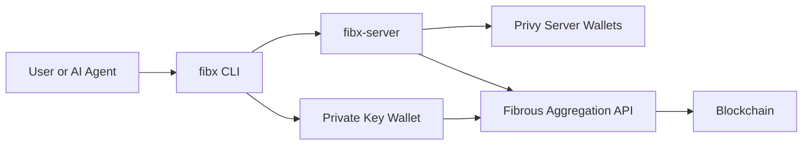

FibX is a CLI-based DeFi execution layer that enables both developers and AI agents to perform on-chain operations — token swaps, transfers, balance checks, and Aave V3 position management — across **Base, Citrea, HyperEVM, and Monad**.

It combines [Fibrous](https://fibrous.finance) aggregation for optimal swap routing with flexible wallet authentication — use your own private key directly, or create a server-managed wallet via [Privy](https://privy.io).

## Core Capabilities

<CardGroup cols={2}>
  <Card title="Token Swaps" icon="arrows-rotate">
    Optimal routing via Fibrous aggregation with auto-slippage. Supports all tokens across integrated DEXs on each chain.
  </Card>
  <Card title="Transfers" icon="paper-plane">
    Send native tokens (ETH, cBTC, HYPE, MON) or any ERC-20 token to any address. All transactions are simulated before execution.
  </Card>
  <Card title="Aave V3" icon="building-columns">
    Supply, borrow, repay, and withdraw on Base. Includes health factor monitoring and liquidation safety checks.
  </Card>
  <Card title="Agent Skills" icon="robot">
    Seven pre-built skills that allow AI agents to authenticate, check balances, trade, send, manage Aave positions, verify transactions, and configure RPC endpoints — all through natural language.
  </Card>
</CardGroup>

## How It Works

FibX operates as a CLI tool (`npx fibx@latest`) that communicates with a backend server for wallet management and transaction execution. Every transaction is simulated before broadcast to prevent failed executions.



## Supported Chains

| Chain    | Native Token | CLI Flag           | Aave V3 |
| -------- | ------------ | ------------------ | ------- |
| Base     | ETH          | `--chain base`     | Yes     |
| Citrea   | cBTC         | `--chain citrea`   | No      |
| HyperEVM | HYPE         | `--chain hyperevm` | No      |
| Monad    | MON          | `--chain monad`    | No      |

## Typical Workflow

Every FibX session follows the same four-step pattern:

<Steps>
  <Step title="Authenticate">
    Import your private key for direct usage, or log in via email OTP to create a Privy server wallet. Either method creates a session that persists across commands.
  </Step>
  <Step title="Check Funds">
    Query native and ERC-20 token balances on the target chain.
  </Step>
  <Step title="Execute">
    Perform a swap, transfer, or Aave operation. The CLI simulates the transaction before submitting it on-chain.
  </Step>
  <Step title="Verify">
    Check the transaction status and obtain the block explorer link.
  </Step>
</Steps>

## Quick Example

```bash
# Authenticate with your private key
npx fibx@latest auth import

# Check balance on Base
npx fibx@latest balance

# Swap 0.1 ETH for USDC
npx fibx@latest trade 0.1 ETH USDC

# Verify the transaction
npx fibx@latest tx-status 0xabc...def
```

## Two Ways to Use FibX

<Tabs>
  <Tab title="As a CLI Tool">
    Run commands directly in your terminal. Ideal for developers who want programmatic access to DeFi operations or need to script workflows.

    ```bash
    npx fibx@latest trade 0.05 ETH USDC --chain base --json
    ```
  </Tab>
  <Tab title="As Agent Skills">
    Import the [fibx-skills](https://github.com/Fibrous-Finance/fibx-skills) into your AI agent's skill registry. The agent interprets natural language prompts and maps them to the appropriate CLI commands.

    | User Prompt                      | Skill Triggered       |
    | -------------------------------- | --------------------- |
    | "Swap 0.05 ETH to USDC"         | `trade`               |
    | "Check my balance on Monad"      | `balance`             |
    | "Send 10 USDC to 0x123..."      | `send`                |
    | "Supply 100 USDC to Aave"       | `aave`                |
    | "I'm getting rate limit errors"  | `config`              |
  </Tab>
</Tabs>

## Resources

<CardGroup cols={2}>
  <Card title="npm Package" icon="npm" href="https://www.npmjs.com/package/fibx">
    fibx v0.3.5 — install and version history
  </Card>
  <Card title="Agent Skills" icon="github" href="https://github.com/Fibrous-Finance/fibx-skills">
    Seven pre-built skills for AI agent integration
  </Card>
  <Card title="MCP Configuration" icon="plug" href="/fibx-agent/mcp-configuration">
    Connect FibX to Cursor, Claude Desktop, Antigravity
  </Card>
</CardGroup>
